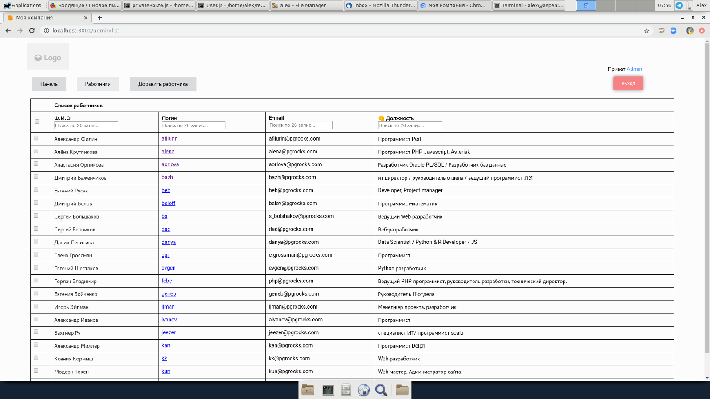

Demo: https://juma24.com

(use https://juma24.com/register to get == instant == access)

This is a fork from Zafar's Time-off app and server a) https://github.com/timeoffthescheduler/app and b) https://github.com/timeoffthescheduler/server, respectedly.

You may use MongoDB or PostgreSQL as the backend; just run the commands "yarn" and  "nodemon index.js" from either of the two folders, "backend" or "backend_pg".

==== PG users

there's no ORM (no, thank you, no :)) - hit your queries directly from "queries.js" definitions

yet the ORM logic has been, in a subtle way, inherited from the MongoDB backend code, for compatibility of both backends with the single front; take it easy.

some scheme definitions for PG (there's only one table "users" in PG, unlike collections Users and Employees in MongoDB):

create table users (_id serial, username text unique, name text, password text, profileimg text, role text, position text, email text, status bool, active bool default true);
create table activities(_id serial, username text, activity text, createdAt timestamp);
create table vacations(_id serial, playerid bigint, start_date date, end_date date, expire bool, createdAt timestamp);
etc.

The server config (user/port, etc.) is found at "queries.js" in the "server" folder.

NB: profile photos are uploaded to "backend/public", so PG users, please take care about the front's correct symbolic link "myCompany/public/img":

"cd myCompany/public; rm img &&  ln -s ../backend_pg/public img" will magically do the trick; also after you build, "cd build && rm -rf img && ln -s ../backend/public img" 

